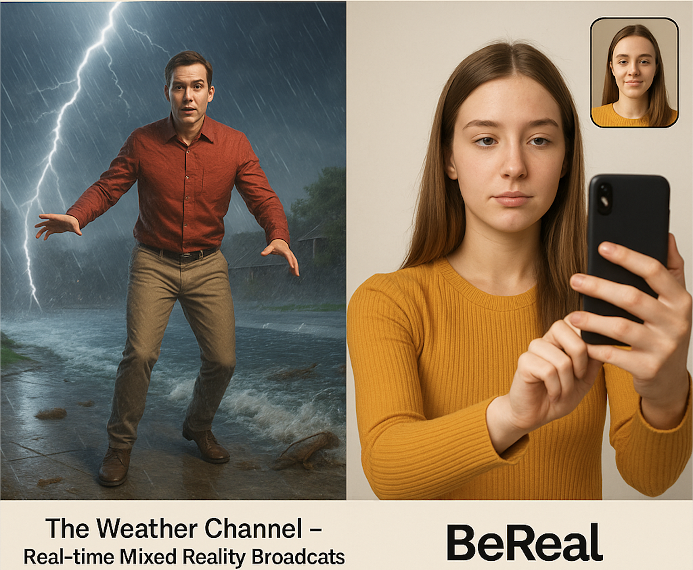

# PACPAC3_Manovich_Reloaded
Autora: Elena Parra Raurell

Assignatura: Cultura Digital - Aula 1 - UOC 

Títol: "Hibridació i softwarització en la cultura visual digital: una aproximació a partir de The Weather Channel i BeReal"

# Introdució 
La transformació de la cultura visual i mediàtica en l’era digital està profundament marcada pel paper central del programari. En El software toma el mando (2013), Lev Manovich argumenta que el programari no només actua com a eina de producció, sinó que s’ha convertit en l’element fonamental que configura, condiciona i redefineix la creació cultural contemporània. Aquesta softwarització implica una hibridació entre formats tradicionals i entorns digitals, generant noves formes d’expressió, percepció i interacció.

En aquest assaig s’exploren dues propostes actuals que exemplifiquen clarament aquest fenomen d’hibridació: les emissions de realitat mixta en temps real de The Weather Channel i l’aplicació social BeReal. Ambdues iniciatives representen maneres innovadores d’integrar tecnologies de programari per reformular els mitjans de comunicació —la televisió i les xarxes socials— des d’una òptica profundament influïda per les lògiques digitals.

Amb una anàlisi crítica basada en els conceptes desenvolupats per Manovich, examinarem com aquests casos materialitzen l’hibridació entre llenguatges i suports, i com el programari esdevé un agent actiu en la configuració de noves narratives visuals i socials. Aquest treball no només busca identificar les estratègies tècniques utilitzades, sinó també entendre el seu impacte cultural i simbòlic dins d’un entorn comunicatiu en constant evolució.

# CAS 1. The Weather Channel – Real-time Mixed Reality Broadcasts
## Descripció del cas
The Weather Channel ha implementat una innovadora forma de presentació meteorològica, combinant tècniques de gràfics en temps real generats amb Unreal Engine i captura de moviment. Els presentadors, en lloc d’estar limitats a un plató convencional, s’integren dins de paisatges digitals en 3D, oferint una experiència immersiva que barreja televisió, videojoc i visualització interactiva. Aquest tipus de presentació permet a l’audiència percebre el contingut d'una manera molt més visual, emocional i dinàmica, creant una nova forma de comunicació de dades en temps real.
## Hibridació i relació amb Manovich
Aquest cas exemplifica perfectament un dels conceptes clau de Lev Manovich: la softwarització del mitjà. Tradicionalment, els canals de televisió utilitzaven un format estèric i limitat per presentar la informació. Amb la integració de gràfics 3D generats per ordinador i el disseny de realitat mixta (MR), el canal crea una interfície immersiva que transcendeix el format de la televisió convencional. A través del programari, la línia entre entorn virtual i món real es difumina, fent que l’espectador experimenti una realitat augmentada.
Manovich parla sovint de com el programari transforma les pràctiques culturals, i aquest cas n’és un exemple clar. El software no només es fa servir per produir gràfics, sinó que reconfigura tota l’experiència de consum del contingut, transformant la manera en què les persones perceben i interactuen amb el món a través dels mitjans de comunicació.
Reflexió crítica
La possibilitat de navegar en escenaris virtuals immersius en temps real obre noves portes per la representació de dades i informació visual. En lloc de només mostrar gràfics estàtics o presentacions convencionals, The Weather Channel incorpora el programari com a motor cultural, creant una nova manera de viure les previsions meteorològiques. Això esdevé una clara demostració de com el programari transforma les interaccions visuals i la manera com ens connectem amb el món.

# CAS 2. BeReal
## Descripció del cas
BeReal és una aplicació social que fomenta una nova manera d’entendre l’autenticitat a través de les xarxes socials. Cada dia, en un moment aleatori, l'aplicació notifica als usuaris que han de fer una foto amb les dues càmeres (davant i darrere) al mateix temps. Aquesta foto es comparteix de manera immediata i autèntica, sense filtres ni edicions. Amb aquesta fórmula, BeReal proposa una ruptura amb els models estètics habituals d’altres xarxes socials com Instagram, que fomenten imatges perfectes i editades.
## Hibridació i relació amb Manovich
A través d'aquest enfocament, BeReal fusiona programació algorítmica, pràctiques visuals quotidianes i estètica digital, creant una nova norma d’autenticitat artificial en la comunicació digital. Seguint la idea de Manovich sobre la softwarització de la cultura, l’aplicació utilitza els algorismes no només per gestionar l’activitat social, sinó també per crear una nova forma d’expressió personal i visual. BeReal transforma la cultura digital creant un context diferent per compartir experiències, trencant la norma de la imatge idealitzada que moltes altres xarxes socials promouen.
El concepte de “autenticitat forçada” és clau en aquest cas, ja que el programari imposa una lògica que busca revertir els estereotips visuals de les xarxes socials mitjançant un procés algorítmic i aleatori, que crea una nova pràctica cultural digital basada en la immediatesa i l’absència de filtratges.
## Reflexió 
BeReal exemplifica la manera com el programari pot redefinir el que entenem per “autenticitat” en el context de la comunicació digital. A través de l’ús d’algorismes i programació, l’aplicació incentiva una estètica visual i comunicativa nova, amb el propòsit de revertir les pràctiques digitals que promouen la perfecta imatge artificial. D’aquesta manera, el programari no només gestiona el contingut, sinó que també regula i imposa noves dinàmiques socials, transformant la nostra relació amb les xarxes i la forma de mostrar-nos al món.

## Conclusió
Els dos exemples presentats (The Weather Channel i BeReal) són perfectes per entendre com el programari està remodelant la cultura visual i les pràctiques socials. Des de la realitat mixta i els gràfics 3D en temps real a la reescriptura de l’autenticitat social digital, ambdós casos ens mostren com les eines digitals i els algorismes no només modifiquen el contingut, sinó que redefinen les formes de comunicació, expressió i interacció en la societat contemporània. Aquests canvis són essencials per comprendre la softwarització de la cultura que Manovich analitza i que es manifesta en múltiples àmbits de la nostra vida quotidiana.

